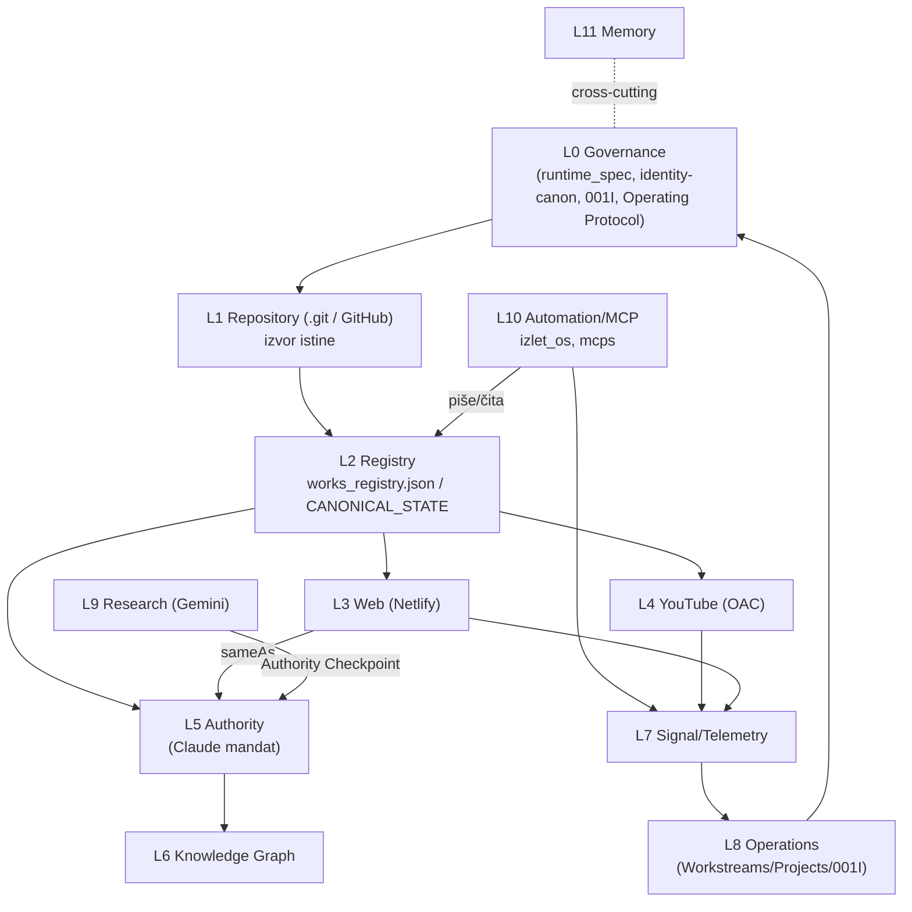

# iZLET_sustav — SYSTEM INDEX (operativna kartografija)
## Jedinstveni operativni indeks. SINTEZA postojećeg, ne novi moduli. „Repo wins."
### Autor: Claude (Ministar autoriteta) · 2026-07-12 · v1 · temelj Phase 0 orijentacije za sve buduće zadatke.

> **Svrha:** povezati postojeću dokumentaciju (repo + Notion) u jedan indeks tako da se prije svakog zadatka zna što već postoji. Ne uvodi doktrinu — pokazuje na postojeću (`runtime_spec_v2_5.md`, `identity-canon.md`, `CLAUDE_OPERATING_PROTOCOL.md`, Notion 4. SYSTEM MAP, 001I, Platform Completion Tracker).
> **Granica pristupa (ova sesija):** montiran cijeli `izlet_sustav` repo (OneDrive) + `diplomski/MRVELJ_CONTENT`. `.git` prisutan. Bash na OneDrive mountu spor (koristiti Read/Grep/Glob). Neke datoteke (`izlet_os/*.py` interni, `task_registry.json`, `transitions.md`) nisu pročitane u dubinu — označeno „⧗ dublji read pending".

---

## 1. SYSTEM INDEX — 12 slojeva

### L0 · GOVERNANCE
- **Svrha:** odluke, doktrine, uloge Kabineta, ratifikacije. General = jedini Decision Authority.
- **Repo:** `docs/runtime_spec_v2_5.md`, `docs/identity-canon.md`, `MRVELJ_CONTENT/CANONICAL_REGISTRY/{CLAUDE_OPERATING_PROTOCOL,ARCHITECTURE_DECISIONS,CANON_v1.0,decision_log}.md`, `CLAUDE.md` (root).
- **Notion:** Doktrina Kabineta v1.0 (LOCKED), 4. SYSTEM MAP, 001I Agent Query Protocol, KAB-OPS-001.
- **Kanonske datoteke:** `runtime_spec_v2_5.md` (Kabinet uloge/mandati; Claude=Ministar Autoriteta), `identity-canon.md` (jezgra identiteta).
- **Status:** implemented / LOCKED.
- **Protokoli:** 001I, Operating Protocol, Runtime Spec.
- **Ovisnosti:** nadređen svima; nijedan sloj se ne mijenja bez General GO.
- **Zadnja revizija:** identity-canon 2026-06-11; runtime spec 2026-05-15.

### L1 · REPOSITORY LAYER
- **Svrha:** izvor istine operativnog sustava + version history. „Repo wins."
- **Repo:** `izlet_sustav/` root (`.git`, `.gitignore`, `.gitattributes`), `netlify.toml`, `_build/`, `.mcp.json`, `.claude/settings.local.json`.
- **Notion:** 4. SYSTEM MAP (Data Layer = GitHub, „kanonska istina").
- **Kanonske datoteke:** `.git`, `netlify.toml`.
- **Status:** implemented (live git repo).
- **Ovisnosti:** hostira sve ostale slojeve.
- **Zadnja revizija:** live (git). ⧗ git log pending (bash spor).

### L2 · REGISTRY LAYER
- **Svrha:** kanonski podaci o djelima/entitetima.
- **Repo:** `registries/` (`works_registry.json`, `entity_url_registry_v1.csv`, `lyrics_corpus_registry.csv`, `works_census_v1/v2.csv`, `youtube_corpus_raw/scored.csv`, `youtube_covers.csv`, `youtube_tag_audit_log.json`, `member_identity_validation.md`), `master_registry.json`, `events_registry.json`, `metrics_registry.json`, `CANONICAL_STATE.md`; `MRVELJ_CONTENT/CANONICAL_REGISTRY/` (CR-0001, CR-0002, works_registry.json, CR-iZLET).
- **Notion:** Platform Completion Tracker, CANONICAL_STATE mirror.
- **Kanonske datoteke:** `works_registry.json` (44 kanonska djela), `CANONICAL_STATE.md` (commit ef74248a).
- **Status:** implemented; coverage: ISWC 72,7% · ISRC 70,5% · MB recording 86,4% · **MB work 11,4% · Discogs 0% · Wikidata QID 0%**.
- **Ovisnosti:** hrani Web, Authority, Signal, YouTube.
- **Zadnja revizija:** 2026-06-04 (CANONICAL_STATE) → **STALE, treba regen** (`_build/make_canonical_metrics.py`).

### L3 · WEB LAYER
- **Svrha:** javna prezentacija autoriteta (bracakumerle.com, Netlify).
- **Repo:** `index.html`, `bio.html`, `diskografija.html`, `kontakt.html`, `vizualni-identitet`, `pjesme/`, `lyrics/`, `arhiva/` (epohe: cmc-demo-2009, dallas-records-era, leteci-majmuni-2012), `people/` (petar/toni-kumerle), `en/`, `global.css`, `netlify/functions`, `izlet_sustav_v2/` (Next.js v2, ⧗ in progress).
- **Notion:** SESSION 29.05 (deploy), VISUAL_IDENTITY_AUTHORITY_SPEC, VISUAL STRATEGY 001/002.
- **Kanonske datoteke:** `index.html` + **inline JSON-LD (hand-authored, po stranici)** = objavljena schema. `data/schema_org_verified.json` = verifikacijski audit (NE web izvor; Track C). `schema_org.json` = legacy/orphan.
- **Status:** implemented / DEPLOYED; citation loop aktivan.
- **Ovisnosti:** čita Registry (/pjesme/, end-screen = source of truth za works listu); hrani Authority (sameAs).
- **Zadnja revizija:** aktivno (`.bak` datoteke → recent edits).
- **Napomena:** Mrvelj sadržaj NE ide na web (CLAUDE.md §11.6).

### L4 · YOUTUBE LAYER
- **Svrha:** primarni javni arhiv + discovery (OAC @bracakumerle).
- **Repo:** `registries/youtube_*` (corpus_raw/scored, covers, review_top40, segment_apply_log/diff 2026-06-11, tag_audit_log), `data/{youtube_archive,youtube_snapshot,yt_video_classes}.json`; `MRVELJ_CONTENT/…/{YOUTUBE_AUDIT_PASS1,YOUTUBE_INVENTORY,YT_CHANNEL_AUDIT,YT_IMPLEMENTATION_PLAN,YT_FORENSIC_STATE}.md`.
- **Notion:** SESSION 29.05 (**Homepage Architecture — IMPLEMENTED**), 3. RESEARCH (epoch model).
- **Uživo:** OAC + **11 playlista** (Official 50, Covers 38, Maksimir Harambaša=autorski, 3 albuma, Live, **Mrvelj obrade**, TV/mediji, Marjanska trilogija).
- **Status:** arhitektura implemented; **full-catalog metadata rollout parcijalan** (15/15 ključnih normalizirano, ~190+ ostatak ne).
- **Ovisnosti:** Registry (corpus), Signal (vidiq), Authority.
- **Zadnja revizija:** segment logovi 2026-06-11; forenzika/audit 2026-07-12.

### L5 · AUTHORITY LAYER (Claude mandat)
- **Svrha:** vanjski entitet-autoritet (Wikipedia/Wikidata/MB/backlinks), entity governance.
- **Repo:** `izlet_os/authority_builder.py`, `schema_builder.py`; `MRVELJ_CONTENT/02_ENTITY_GRAPH/` (AUTHORITY_GRAPH_v1.0_LOCKED, ENTITY_EVOLUTION_LOG, ENTITY_NAME_STRATEGY, AUTHORITY_ROADMAP), `04_AUTHORITY_ANALYSIS/`.
- **Notion:** Authority Status pages, VISUAL STRATEGY 002.
- **Kanonske datoteke:** `authority_ledger.json`, CR-0001/0002, AUTHORITY_GRAPH_v1.0_LOCKED.
- **Status:** implemented + ACTIVE (Mrvelj kampanja).
- **Ovisnosti:** Registry, Web (sameAs), KG.
- **Zadnja revizija:** 2026-07-12.

### L6 · KNOWLEDGE GRAPH LAYER
- **Svrha:** Google KG / Wikidata graf prisutnost; cross-links.
- **Repo:** `data/{wikidata_snapshot,wikidata_state,schema_org,schema_org_verified}.json`; `MRVELJ_CONTENT/02_ENTITY_GRAPH/ENTITY_EVOLUTION_LOG.md` (KP milestone).
- **Notion:** 00 Doktrina (Reality→…→Knowledge Graph→Discovery).
- **Kanonske datoteke:** `wikidata_state.json`, `schema_org_verified.json`.
- **Status:** implemented; **KP milestone 2026-07-12** (oba panela + bidirekcionalni cross-link Mrvelj↔iZLET).
- **Ovisnosti:** Authority, Registry, Web.
- **Zadnja revizija:** 2026-07-12.

### L7 · SIGNAL LAYER
- **Svrha:** telemetrija, metrike, monitoring.
- **Repo:** `metrics_registry.json`, `data/{canonical_metrics,facebook_snapshot,facebook_posts,mb_snapshot,spotify_enrichment_preview,system_status}.json`; `MRVELJ_CONTENT/…/{SIGNAL_REPORT_T1,BASELINE_2026-07-10,SIGNAL_LOG}.md`.
- **Notion:** 2. SIGNALS (DB).
- **Kanonske datoteke:** `system_status.json` (last_run 2026-05-02 → STALE), `canonical_metrics.json`.
- **Protokoli:** scheduled task „mrvelj-daily-signal" (09:06), Convergence Object Standard (runtime spec).
- **Status:** implemented + ACTIVE (dnevni monitoring).
- **Ovisnosti:** vidiq/platforme (telemetrija) → hrani Operations.
- **Zadnja revizija:** 2026-07-12 (T1); system_status 2026-05-02.

### L8 · OPERATIONS LAYER
- **Svrha:** koordinacija, izvršenje zadataka, workstreamovi.
- **Repo:** `data/task_registry.json` (⧗ pending), `MRVELJ_CONTENT` campaign/production, `decision_log.md`.
- **Notion:** 1. OPERATIONS (DB), Workstreams (DB), Projects (DB), KAB-OPS-001, 001F/001G/001B.
- **Kanonske datoteke:** KAB-OPS-001 (operativni mirror), `task_registry.json`.
- **Protokoli:** 001I Agent Query Protocol (redoslijed: Workstreams→Projects→Blockers→priority).
- **Status:** implemented + ACTIVE.
- **Ovisnosti:** čita Registry/Signal; General odluke.
- **Zadnja revizija:** 2026-07-12 (KAB-OPS ažuriran).

### L9 · RESEARCH LAYER
- **Svrha:** unvalidated forecasting, institucionalna topologija, media graf (Gemini mandat).
- **Repo:** `MRVELJ_CONTENT/06_METHOD_LOG/` (research_log, method_evolution), `04_AUTHORITY_ANALYSIS/`, `FESTIVAL_*` docs.
- **Notion:** 3. RESEARCH.
- **Status:** ACTIVE (nevalidiran sloj — ne miješati s kanonom).
- **Ovisnosti:** hrani Authority preko validacije (Authority Checkpoint).
- **Zadnja revizija:** ~lipanj 2026.

### L10 · AUTOMATION / MCP LAYER
- **Svrha:** pipeline-i, agenti, MCP serveri, build.
- **Repo:** `izlet_os/` (`orchestrator.py`, `authority_builder.py`, `network_agent.py`, `reporter.py`, `schema_builder.py`, `enrichers/`, `streaming/`, `socials/`), `connectors/facebook_agent.py`, `mcps/` (grok_com_github, vidiq), `netlify/functions`, `_build/`, `.mcp.json`.
- **Notion:** —.
- **Kanonske datoteke:** `izlet_os/orchestrator.py`, `.mcp.json`. ⧗ interni Python nije čitan u dubinu.
- **Status:** implemented (Python OS + MCP).
- **Ovisnosti:** čita/piše Registry, Data, Signal.
- **Zadnja revizija:** ⧗ git pending.

### L11 · MEMORY LAYER
- **Svrha:** kontinuitet sesija, naučene činjenice.
- **Repo:** `memory/session_log.md`; (Cowork `MEMORY.md` + spaces — zaseban od repoa).
- **Notion:** HANDOFF — Claude Reconstruction Brief.
- **Status:** implemented.
- **Ovisnosti:** cross-cutting.
- **Zadnja revizija:** live.

---

## 2. ORIENTATION GRAPH — kako su slojevi povezani



**Kanonski ciklus (Operating Protocol §4 / 00 Doktrina):**
`Registry → Evidence → Decision → Execution → Verification → Gate → Publication → Observation → Next`
(= `Reality → Authority → Signal → Knowledge Graph → Discovery`)

**Pravila separacije (4. SYSTEM MAP):** Telemetry ≠ Authority ≠ Interpretation · nema cross-layer data fusion · interpretacija izvan Notiona.

---

## 3. PHASE 0 EXECUTION PATH (obavezno prije svakog većeg zadatka)
Nadograđuje 001I + Operating Protocol §1 — ne zamjenjuje ih.

```
0. GRANICA PRISTUPA — što je montirano? (cijeli repo? podskup? Notion?) → deklariraj eksplicitno.
1. GOVERNANCE — pročitaj: OVAJ SYSTEM_INDEX + runtime_spec_v2_5 + CLAUDE_OPERATING_PROTOCOL + 001I.
2. LOCIRAJ SLOJ — nađi subsystem u §1 → njegove kanonske datoteke + Notion doc + status.
3. ČITAJ KANON SLOJA — te datoteke + Platform Completion Tracker (Presence/Status/What is done/What is missing).
4. RATIFIKACIJE — decision_log.md + relevantne LOCKED/APPROVED odluke (identity-canon, runtime_spec…).
   ↓ tek onda
5. JAVNA POVRŠINA (kanal/web/registri uživo).
6. GAP ANALIZA — kroz FALSE GAP DEFENCE (§4).
```
Output-obveza: prije prijedloga napiši blok „**Phase 0 — što postoji / status / izvor / granica pristupa**".

---

## 4. FALSE GAP DEFENCE (obavezno prije proglašenja gapa)
Prije nego išta proglasiš „gapom", odgovori na 4 pitanja s izvorom:

| # | Pitanje | Provjeri u |
|---|---|---|
| 1 | Postoji li već rješenje? | §1 kanonske datoteke + repo (Grep/Glob) |
| 2 | Postoji li ratificirana odluka? | decision_log, identity-canon, runtime_spec, Notion ratifikacije |
| 3 | Postoji li implementacija? | Platform Completion Tracker status + repo (web/izlet_os/playliste) |
| 4 | Postoji li otvoreni workstream? | Workstreams / Projects DB (001I) |

**Zakon:** tek ako su SVA ČETIRI odgovora „NE" → nešto smije biti gap. Inače: FALSE GAP (ili: postojeće/ratificirano/implementirano/u-tijeku).

---

## 5. RECONCILIATION — današnji artefakti vs postojeći kanon (primjena FALSE GAP DEFENCE na vlastiti rad)
- **ENTITY_NAME_STRATEGY (2026-07-12)** djelomično re-derivira **`identity-canon.md` (APPROVED 2026-06-11)**: kanon već definira `creative_identity: iZLET` / `publishing_identity: Braća Kumerle`. → Moja „entitet vs handle" podjela mora **deferirati na identity-canon kao kanon**; njezin ADITIVAN dio = „izlet" common-noun kolizija + per-surface discovery mapa. Označeno da se ne tretira kao nova odluka.
- **YT_IMPLEMENTATION_PLAN / AUDIT** — false gapovi već zabilježeni u `YT_FORENSIC_STATE_2026-07-12.md`.
- **PROPOSAL_Phase0_System_Orientation.md** — ovaj SYSTEM_INDEX je njegova izvedba; Phase 0 pravilo čeka Generalovu ratifikaciju.

---

## 6. OTVORENO / ⧗ ZA DOVRŠITI (dublji read u idućem prolazu)
- `izlet_os/*.py` (orchestrator/authority_builder logika), `data/task_registry.json`, `docs/transitions.md`, `izlet_sustav_v2/` (Next.js v2 status), git log per-sloj (bash spor na OneDrive).
- Regen `CANONICAL_STATE.md` (stale 2026-06-04) i `system_status.json` (stale 2026-05-02).

---
*SYSTEM INDEX v1 · 2026-07-12 · sinteza postojećeg · „repo wins" · ne mijenja protokole, ne stvara module. Temelj Phase 0.*
